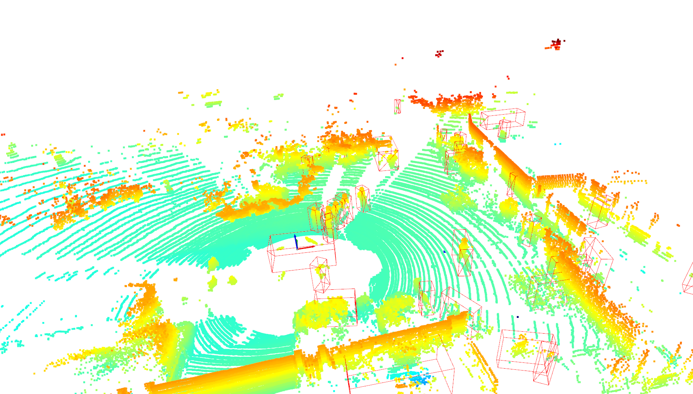

# simple-pointpillar-pytorch
> This is just a simple implementation of "PointPillars: Fast Encoders for Object Detection from Point Clouds".  
> office: [nutonomy/second.pytorch](https://github.com/nutonomy/second.pytorch)  
> arxiv: [https://arxiv.org/pdf/1812.0578](https://arxiv.org/pdf/1812.0578)  
> OpenPCDet: [https://github.com/open-mmlab/OpenPCDet](https://github.com/open-mmlab/OpenPCDet)


# Motivation

- Unlike the other repo, I just used pure pytorch. That is, you don't need to compile anything to run the code, I've rewritten the voxelization and 3D NMS in python and run it on the cpu. Just run it and learning. 
- The official code is so complex that it's hard to get started, so I've created this repository with just the core code. Unlike most implementation base on [office](https://github.com/nutonomy/second.pytorch) or [OpenPCDet](https://github.com/open-mmlab/OpenPCDet), I made the code as simple as possible to understand, no trick, as close to the original performance as possible(I hope so).  
- At present, only the official weights of [OpenPCDet](https://github.com/open-mmlab/OpenPCDet) have been implemented for inference, but the core code is basically completed and the training code will be improved continuously.

# Repo Commit
- `cfgs/kitti_cfg.py` contains the relevant configuration for the kitti dataset
- `kitti_test_data/` are 10 point cloud data from kitti to run infer demo.
- `openpcdet-office-ckpt/pointpillar_7728.pth` Good weights from the [official openpcdet](https://github.com/open-mmlab/OpenPCDet/blob/master/tools/cfgs/waymo_models/pointpillar_1x.yaml)

# Todo

- [x] Direct inference using official weights and obtaining consistent results.
- [ ] Training Code.
- [ ] So on.

# Requirements

Win10 or Linux.
```
torch
numpy
opencv-python
easydict
open3d
```

# How to inference

```python infer.py``` and take a bathroom break and wait for visualization results.

# Some simple results

